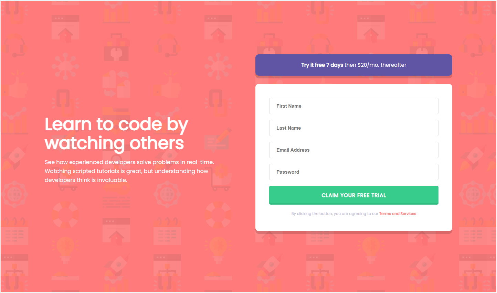

# Frontend Mentor - Intro component with sign up form solution

This is a solution to the [Intro component with sign up form challenge on Frontend Mentor](https://www.frontendmentor.io/challenges/intro-component-with-signup-form-5cf91bd49edda32581d28fd1). Frontend Mentor challenges help you improve your coding skills by building realistic projects.

## Table of contents

- [Overview](#overview)
  - [The challenge](#the-challenge)
  - [Screenshot](#screenshot)
  - [Links](#links)
- [My process](#my-process)
  - [Built with](#built-with)
  - [What I learned](#what-i-learned)
  - [Continued development](#continued-development)
  - [Useful resources](#useful-resources)
- [Author](#author)
- [Acknowledgments](#acknowledgments)

**Note: Delete this note and update the table of contents based on what sections you keep.**

## Overview

### The challenge

Users should be able to:

- View the optimal layout for the site depending on their device's screen size
- See hover states for all interactive elements on the page
- Receive an error message when the `form` is submitted if:
  - Any `input` field is empty. The message for this error should say _"[Field Name] cannot be empty"_
  - The email address is not formatted correctly (i.e. a correct email address should have this structure: `name@host.tld`). The message for this error should say _"Looks like this is not an email"_

### Screenshot



### Links

- Solution URL: [Github repo](https://github.com/KarolisGaiv/signup-form)
- Live Site URL: [Check it live!](https://karolisgaiv.github.io/signup-form/)

## My process

### Built with

- Semantic HTML5 markup
- CSS custom properties
- Flexbox
- Mobile-first workflow

### What I learned

- Mobile-first workflow. Because I haven't tried using Mobile-first workflow in my previous projects I've decided to give it a go for this one and was really happy with the result. I didn't have to solve that many responsiveness issues later.
- Semantic/accesibility focused forms. While this is quite straightforward form, I wanted to spend more time in understading forms, how to create them in accesibility proper way. Really happy to get a deeper understanding of label function and while this is not my creation, I'm happy that I've found this little neat CSS trick to hide labels while still maintaining all semantic and accesibility rules:

```html
<label for="lastName" class="visuallyhidden">Last Name</label>
```

```css
.visuallyhidden {
  border: 0;
  clip: rect(0 0 0 0);
  height: 1px;
  margin: 1px;
  overflow: hidden;
  padding: 0;
  position: absolute;
  width: 1px;
}
```

### Continued development

My plan is to continue working on my CSS and JS skills. While this project didn't require much JS, I still believe that there are better and more refined ways to do form validation than what I've written. KISS and DRY rules should be priority areas where I should focus in the future.

### Useful resources

- [How to build HTML Forms](https://austingil.com/how-to-build-html-forms-right-semantics/) - This helped me with understanding how to properly create forms. It is written in easy to understand manner and has a lot of examples.

## Author

- Website - [Karolis Gaivenis](https://karolisgaiv.github.io/signup-form/)
- Frontend Mentor - [@KarolisGaiv](https://www.frontendmentor.io/profile/KarolisGaiv)
